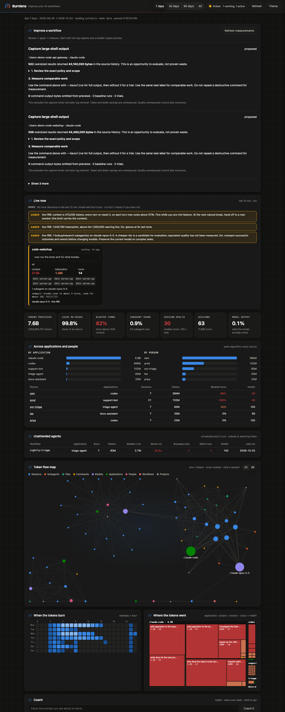
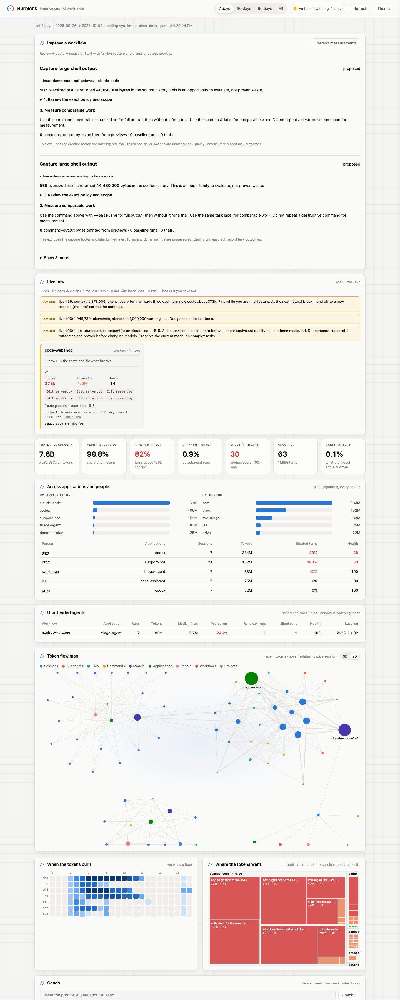

# Burnlens

[](https://github.com/Eyshika/burnlens/actions/workflows/ci.yml)
[](LICENSE)
[](pyproject.toml)
[](pyproject.toml)

**See where your AI coding agent's tokens went, what wasted them, and what to do about it.**

Burnlens reads the transcripts your agent already writes, shows live sessions as they burn,
and (optionally) steps in before an expensive tool call. It runs on your machine. No account,
no API key, no proxy, no third-party requests, and no Python dependencies.



<details>
<summary>Light theme</summary>



</details>

## Try it in 30 seconds

```bash
git clone https://github.com/Eyshika/burnlens.git
cd burnlens
python3 -m venv .venv && source .venv/bin/activate
pip install -e .

burnlens ui --demo      # synthetic sessions, nothing of yours is read
burnlens ui             # your own Claude Code history
```

The dashboard opens at `http://127.0.0.1:8765`. On macOS you can also double-click
`Burnlens.command`.

Requires Python 3.11+. Tested on macOS and Linux.

## Why

On a coding-agent subscription almost none of the cost is what you type or what the model
writes back. On one heavy user's machine, across 36k assistant turns:

| Token class | Share |
|---|---|
| cache read (re-reading context already there) | 98.0% |
| cache write | 1.7% |
| output | 0.3% |
| fresh input | 0.0% |

A usage driver is **context size x number of turns**. Burnlens shows which sessions, files,
commands and subagents drive that, and which habits would change it.

Token totals do not map directly to your quota or your bill: model, effort level, caching and
the agent's own context management all matter. Burnlens reports what it can measure,
labels what it infers, and never presents a projection as a saving.

## What you get

- **Live now.** Every session active in the last 10 minutes: last prompt, last tools,
  context size, tokens per minute, subagents and their model. A green / amber / red zone in the
  top bar; amber and red alerts fire a macOS notification even with no browser tab open.
- **Key numbers.** Tokens processed, cache re-read share, bloated turns, session health,
  subagent share.
- **Token flow map.** A 3D graph (2D fallback) of where tokens attached: projects, sessions,
  subagents, models, files, commands. Hover to isolate a neighbourhood, click a session to open it.
- **When and where.** A weekday-by-hour heatmap and a treemap of project and session, coloured
  by health.
- **Findings.** What looks wasteful, the evidence, and the fix, phrased as Don't / Do.
- **Coach.** Judges a prompt before you send it and lists recurring habits week over week.
- **Teacher.** Notices instructions you keep retyping and drafts the `CLAUDE.md` lines or
  skill that would replace them.
- **Handoff.** One click to start a fresh session without losing the thread.
- **Brake.** Optional Claude Code hooks that ask or deny before a huge read or a noisy command.
- **Unattended agents.** Scheduled and CI runs compared against their own history.
- **Explain (optional).** Ask a model to tell the story of one session, from a digest only.

## Supported agents

| Agent or source | Connection | Live guidance |
|---|---|---|
| Claude Code | Native local transcripts (`~/.claude/projects`) | Hooks (`burnlens install-hooks`) |
| Codex CLI | Native rollout JSONL (`$CODEX_HOME/sessions`) | Copy policy, explicit `capture` |
| Gemini CLI | Native saved chats (`~/.gemini/tmp`) | Copy policy, explicit `capture` |
| LiteLLM, Langfuse, OpenTelemetry | Log files, exports or OTLP | none |
| Cursor, Copilot, Windsurf, Cline, Aider, others | Export to the generic JSONL in [docs/INGEST.md](docs/INGEST.md) | none |

Native readers follow internal, persisted formats and are best effort. Truncated tool output,
omitted records and session rewinds limit completeness. These imports are not billing
reconciliation. Naming an agent here does not mean it exposes its usage; see
[docs/INGEST.md](docs/INGEST.md).

```bash
burnlens ui --discover-agents                 # Claude, Codex and Gemini history found locally
burnlens --source codex                       # one source from the CLI
burnlens ui --codex-root /path/to/sessions --gemini-root /path/to/chats
```

## Privacy, keys and what leaves your machine

- Analysis, the dashboard, the coach, the teacher and the hooks are **fully local**. They need no
  key and make no network request. The 3D map library is bundled, not loaded from a CDN.
- The server binds to `127.0.0.1` and the action API requires a per-server token.
- The **only** feature that sends anything out is `burnlens explain` (and the Explain button),
  and only after you set a key. It sends a digest: prompts, file names, command heads and sizes.
  Never file contents or tool output.
- Keys are read from **environment variables only**. Nothing is written to disk and there is no
  config field for a key. Copy [`.env.example`](.env.example) to `.env` (gitignored) and load it:

```bash
cp .env.example .env            # fill in the placeholders
set -a; source .env; set +a
burnlens explain <session-id>
```

| Variable | Purpose |
|---|---|
| `BURNLENS_LLM_API_KEY` | Key for any OpenAI-compatible endpoint (falls back to `OPENROUTER_API_KEY`) |
| `ANTHROPIC_API_KEY` | Used with the native Anthropic endpoint when no other key is set |
| `BURNLENS_LLM_BASE_URL`, `BURNLENS_LLM_MODEL`, `BURNLENS_LLM_FORMAT` | Endpoint, model, `openai` or `anthropic` wire format |
| `BURNLENS_STATE_DIR` | Where state lives (default `~/.burnlens`) |
| `BURNLENS_CONFIG` | Path to a `burnlens.toml` |

Explanations are cached in `~/.burnlens/explanations/`, so a session is billed once.

## Turn on the brake

```bash
burnlens install-hooks            # remove with: burnlens install-hooks --remove
```

This registers a Claude Code `PreToolUse` hook. Before every `Read`, `Bash` and `Agent` call,
Burnlens checks the session's context and the call itself:

| Situation | Green | Amber (context > 150k) | Red (context > 300k) |
|---|---|---|---|
| Read of a file > 50 KB without a line range | allow + note | ask | **deny** with reason |
| Shell command that prints a lot, with no `head` / `grep` | allow + note | ask | **deny** with reason |
| Image read | allow + note | ask | ask |
| Candidate for a cheaper model | allow + note | ask | ask with reason |

Burnlens never rewrites your tool input, switches your model, or truncates a read. **Ask** shows
you Claude Code's permission prompt with the reason; **deny** sends the reason back to the agent.
Add `--strict` to approve every automatic subagent yourself.

Every decision is logged to `~/.burnlens/hook-events.jsonl` and shown live in the app.

## The coach

With the hooks installed, every prompt you submit is read first and you get a short note:

```
Burnlens: Expensive, not wrong: context is 712,400 tokens, so every turn now costs about 712k.
Compacting pays for itself after about 2 more turns. Keep going if you are mid-feature.
At the next natural break, hand off to a new session; the brief carries the context.
```

Try a prompt without sending it:

```bash
burnlens coach "check any bugs in the whole repo"
```

`burnlens habits` lists recurring waste week over week. Compaction break-even is priced from
[`burnlens/prices.toml`](burnlens/prices.toml); its retained-context and summary sizes are
assumptions, so the figure is labelled `projected`.

Findings, habits and lessons expose `avoidable_tokens: null` and `savings_status: "unmeasured"`:
history alone cannot say what a successful alternative would have cost.

## The teacher

| Pattern in your prompts | Lesson | Draft it hands you |
|---|---|---|
| the same standing instruction in 3+ sessions | `CLAUDE.md` | the lines to paste |
| the same multi-step ask in 3+ sessions | a skill | a `SKILL.md` skeleton |
| the same research question in 3+ sessions | saved research | a doc path and pointer |
| prompts pasting thousands of characters | file reference | the grep / line-range phrasing |
| the same files read at the start of most sessions | project map | five `CLAUDE.md` lines |

```bash
burnlens lessons
```

## Hand off without losing the thread

```bash
burnlens handoff <session-id>
```

Builds a brief from the transcript, locally and without a model: goal, latest ask, files in play,
the commands the agent leaned on, and an opening prompt for the next session. In the app: open a
session, then "Generate handoff brief".

## Several applications, one view

```bash
burnlens ui --generic-root traces/codex --generic-root traces/support-bot
burnlens ui --litellm-root /path/to/litellm-logs
burnlens ui --langfuse-root /path/to/export
```

The dashboard then shows tokens by application and person, plus a people table. Claude Code can
also push OTLP over HTTP to the built-in receiver. Formats and field mapping:
[docs/INGEST.md](docs/INGEST.md).

Not built: authentication on the OTLP receiver, a database instead of the JSONL spool, and a
container image. The server is meant for localhost, not for exposure on a network.

## Configuration

Every threshold, the rules you can disable, the premium-model markers and the coach's
task-to-tier table live in one file. Copy [`burnlens.example.toml`](burnlens.example.toml) to
`./burnlens.toml` or `~/.burnlens/burnlens.toml`, or pass `--config` / `BURNLENS_CONFIG`.

Prices come from `burnlens/prices.toml`. List prices change, so check the `as_of` date and
update it only when you have re-checked the numbers.

## Review, apply and measure

Oversized shell results produce a project-scoped proposal in the dashboard. Review the exact
policy, apply it, then measure comparable work:

```bash
burnlens capture --action <action-id> --task 'comparable-task' --baseline -- python check.py
burnlens capture --action <action-id> --task 'comparable-task' -- python check.py
```

`capture` runs the argv you give it without a shell, keeps the full log, and preserves the exit
code. It measures command-output bytes omitted from previews, runtime and exit status. Token and
dollar savings and effects on quality stay unmeasured; outcomes are what you report.

## Command line

```bash
burnlens                        # text report with findings
burnlens --days 7               # last week
burnlens sessions --top 20      # rank sessions by tokens
burnlens session 774f29         # one session (id prefix)
burnlens --json > report.json   # machine-readable
burnlens ui --demo              # synthetic data
```

`--root`, `--days`, `--since`, `--top`, `--context-threshold` and `--large-payload` work before or
after the subcommand. `tokprof` is kept as an alias for the old name.

## Findings rules

| Rule | Fires when |
|---|---|
| `context-bloat` | a session ran most of its turns above the context threshold |
| `long-session` | a session exceeded 500 turns |
| `repeated-reads` | a file was read 10+ times |
| `image-rereads` | an image was read 2+ times |
| `large-payloads` | tool results over 50 KB pushed megabytes into context |
| `subagent-premium-model` | most subagent tokens ran on a premium-tier model |

All thresholds are in [`burnlens.example.toml`](burnlens.example.toml).

## Limits

- Dollar cost is not reported as a bill; token classes are raw and price weighting is an estimate.
- Realized savings are not measured. Findings are opportunities to evaluate.
- A cheaper-model suggestion never establishes equal quality.
- Cursor and Copilot expose little locally; they need an export.

## Alternatives

[ccusage](https://github.com/ryoppippi/ccusage) is the established daily and session cost
report across many agents. Burnlens adds per-file, per-command and per-subagent attribution,
live alerts, the pre-call brake and the coach. Claude Code's native OpenTelemetry export covers
metrics if you already run a collector; Burnlens can ingest it.

## Development

```bash
pip install -e ".[dev]"
ruff check burnlens tests
pytest -q
```

Layout, transcript format and hook protocol: [docs/DESIGN.md](docs/DESIGN.md). See
[CONTRIBUTING.md](CONTRIBUTING.md) before opening a pull request, and
[SECURITY.md](SECURITY.md) to report a vulnerability.

## License

[MIT](LICENSE). The bundled [3d-force-graph](https://github.com/vasturiano/3d-force-graph) is MIT
licensed; see [THIRD_PARTY_NOTICES.md](THIRD_PARTY_NOTICES.md).
